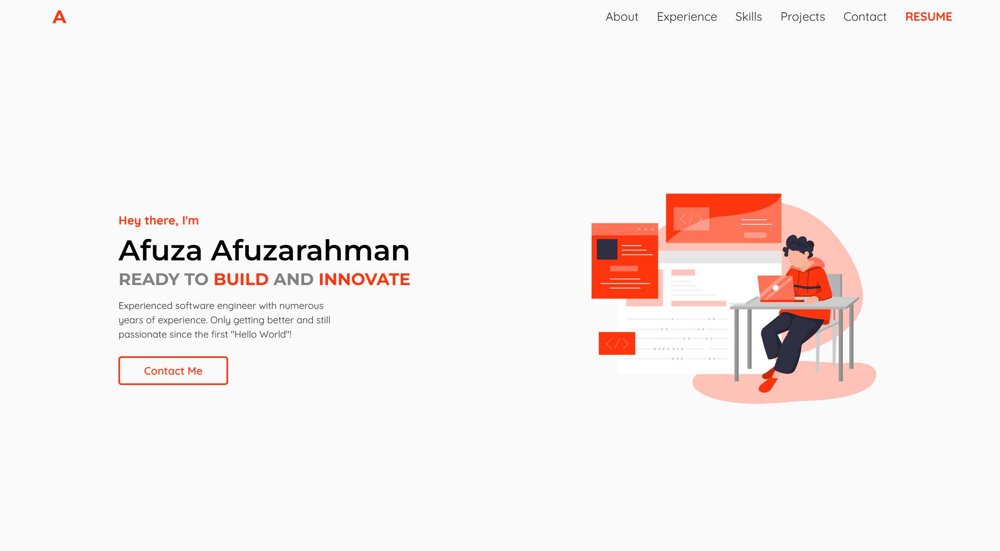

# Portfolio

Website Link: [afutofu.github.io](https://afutofu.github.io/)

Online portfolio for Afuza Afuzarahman.



Technologies used:

- [React](https://reactjs.org/)
- [GSAP](https://greensock.com/gsap/)
- [Styled Components](https://styled-components.com/)

Features in this version:

- Displays general information
- Displays featured projects
- Displays other projects
- Complete links to code and live sites
- Viewable and downloadable resume
- Social links

1 Clone repository:

```
git clone https://github.com/afutofu/afutofu.github.io.git
```

2 Install dependencies:

```
npm install
```

3 Start locally with:

```
npm start
```
